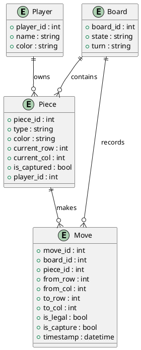

# Chinese Chess (象棋) ERD

本 ERD 針對 BDD `chess.feature` 的規則設計，描述棋盤、棋子、玩家等主要實體及其關聯。

---

## Entities & Relationships

### 1. Player
- **player_id** (PK)
- name
- color (Red/Black)

### 2. Piece
- **piece_id** (PK)
- type (General, Guard, Rook, Horse, Cannon, Elephant, Soldier)
- color (Red/Black)
- current_row
- current_col
- is_captured (bool)
- player_id (FK → Player)

### 3. Board
- **board_id** (PK)
- state (可選: JSON 或快照)
- turn (Red/Black)

### 4. Move
- **move_id** (PK)
- board_id (FK → Board)
- piece_id (FK → Piece)
- from_row
- from_col
- to_row
- to_col
- is_legal (bool)
- is_capture (bool)
- timestamp

---

## 關聯說明
- 一個 Player 擁有多個 Piece。
- 一個 Board 上有多個 Piece。
- 每次 Move 會記錄是哪個 Piece、從哪裡移動到哪裡，並標記是否合法、是否吃子。
- Board 可記錄當前狀態與輪到誰。

---

## ERD 圖（文字版）

```
Player (1) ────< (N) Piece

Board (1) ────< (N) Move
Piece (1) ────< (N) Move

Board (1) ────< (N) Piece
```

---

## ERD 圖 (PlantUML)



## 補充
- 若需支援複盤或多局，可將 Board 與 Move 設計為一對多。
- 若需記錄完整棋譜，可擴充 Move。
- 若需支援多玩家或觀戰，可擴充 Player。

---

如需圖形化 ERD，可用 draw.io、dbdiagram.io 等工具繪製。

如果你已經在 chessERD.md 中插入了 PlantUML 語法區塊，但 VS Code 仍無法預覽，常見原因如下：

1. PlantUML 擴充套件未安裝或未啟用。
2. 未設定 plantuml.server，或網路無法連線到指定 server。
3. 檔案副檔名不是 .puml 或 .plantuml（部分擴充套件只支援這些副檔名的即時預覽）。
4. 語法區塊標記錯誤（需為 ```plantuml ... ```）。

解決方式：
- 確認已安裝 PlantUML 擴充套件。
- 在 VS Code 設定中加入：
  ```
  "plantuml.server": "http://www.plantuml.com/plantuml"
  ```
- 將 PlantUML 區塊內容複製到 .puml 檔案，右鍵選單選「Preview Current Diagram」。
- 或直接將區塊內容貼到 plantuml.com/zh/plantuml 官網線上預覽。

如果還是無法預覽，請提供錯誤訊息或描述目前的操作步驟，我可以協助你排查！- 將 PlantUML 區塊內容複製到 .puml 檔案，右鍵選單選「Preview Current Diagram」。
- 或直接將區塊內容貼到 plantuml.com/zh/plantuml 官網線上預覽。

如果還是無法預覽，請提供錯誤訊息或描述目前的操作步驟，我可以協助你排查！
